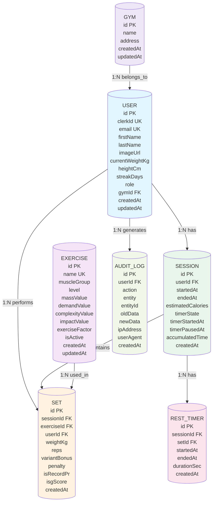

```mermaid
flowchart TD
    %% Entidades
    USER[("USER\nid PK\nclerkId UK\nemail UK\nfirstName\nlastName\nimageUrl\ncurrentWeightKg\nheightCm\nstreakDays\nrole\ngymId FK\ncreatedAt\nupdatedAt")]
    EXERCISE[("EXERCISE\nid PK\nname UK\nmuscleGroup\nlevel\nmassValue\ndemandValue\ncomplexityValue\nimpactValue\nexerciseFactor\nisActive\ncreatedAt\nupdatedAt")]
    SESSION[("SESSION\nid PK\nuserId FK\nstartedAt\nendedAt\nestimatedCalories\ntimerState\ntimerStartedAt\ntimerPausedAt\naccumulatedTime\ncreatedAt")]
    SET[("SET\nid PK\nsessionId FK\nexerciseId FK\nuserId FK\nweightKg\nreps\nvariantBonus\npenalty\nisRecordPr\nisgScore\ncreatedAt")]
    REST_TIMER[("REST_TIMER\nid PK\nsessionId FK\nsetId FK\nstartedAt\nendedAt\ndurationSec\ncreatedAt")]
    AUDIT_LOG[("AUDIT_LOG\nid PK\nuserId FK\naction\nentity\nentityId\noldData\nnewData\nipAddress\nuserAgent\ncreatedAt")]
    GYM[("GYM\nid PK\nname\naddress\ncreatedAt\nupdatedAt")]

    %% Relaciones
    USER -->|"1:N has"| SESSION
    USER -->|"1:N performs"| SET
    USER -->|"1:N generates"| AUDIT_LOG
    SESSION -->|"1:N contains"| SET
    SESSION -->|"1:N has"| REST_TIMER
    EXERCISE -->|"1:N used_in"| SET
    GYM -->|"1:N belongs_to"| USER

    style USER fill:#e1f5fe
    style EXERCISE fill:#f3e5f5
    style SESSION fill:#e8f5e9
    style SET fill:#fff3e0
    style REST_TIMER fill:#fce4ec
    style AUDIT_LOG fill:#f1f8e9
    style GYM fill:#ede7f6
```