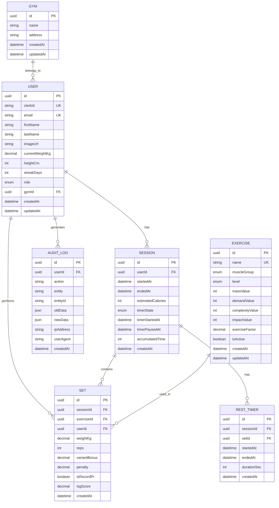

```mermaid
erDiagram
    USER ||--o{ SESSION : "has"
    USER ||--o{ SET : "performs"
    USER ||--o{ AUDIT_LOG : "generates"
    SESSION ||--o{ SET : "contains"
    SESSION ||--o{ REST_TIMER : "has"
    EXERCISE ||--o{ SET : "used_in"
    GYM ||--o{ USER : "belongs_to"

    USER {
        uuid id PK
        string clerkId UK
        string email UK
        string firstName
        string lastName
        string imageUrl
        decimal currentWeightKg
        int heightCm
        int streakDays
        enum role
        uuid gymId FK
        datetime createdAt
        datetime updatedAt
    }

    EXERCISE {
        uuid id PK
        string name UK
        enum muscleGroup
        enum level
        int massValue
        int demandValue
        int complexityValue
        int impactValue
        decimal exerciseFactor
        boolean isActive
        datetime createdAt
        datetime updatedAt
    }

    SESSION {
        uuid id PK
        uuid userId FK
        datetime startedAt
        datetime endedAt
        int estimatedCalories
        enum timerState
        datetime timerStartedAt
        datetime timerPausedAt
        int accumulatedTime
        datetime createdAt
    }

    SET {
        uuid id PK
        uuid sessionId FK
        uuid exerciseId FK
        uuid userId FK
        decimal weightKg
        int reps
        decimal variantBonus
        decimal penalty
        boolean isRecordPr
        decimal isgScore
        datetime createdAt
    }

    REST_TIMER {
        uuid id PK
        uuid sessionId FK
        uuid setId FK
        datetime startedAt
        datetime endedAt
        int durationSec
        datetime createdAt
    }

    AUDIT_LOG {
        uuid id PK
        uuid userId FK
        string action
        string entity
        string entityId
        json oldData
        json newData
        string ipAddress
        string userAgent
        datetime createdAt
    }

    GYM {
        uuid id PK
        string name
        string address
        datetime createdAt
        datetime updatedAt
    }
```

**Nota:** La tabla `GYM` no está definida en el schema.prisma actual, pero se referencia en `User.gymId`. Deberías agregarla si planeas usarla.